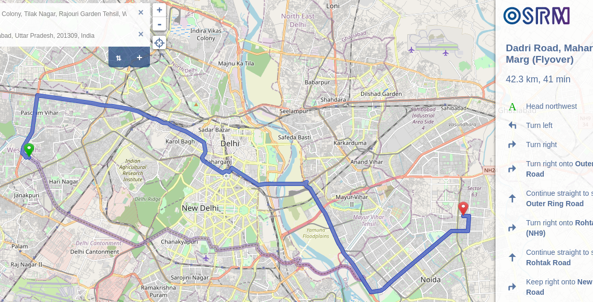

# osrm_custom_poly
A ready docker config to deploy OSRM for any place, using custom .poly file



## Build

```
docker build -t osrm_custom_poly .
```

## Run OSRM API

**IMPORTANT:** Create a "data" folder in your working folder where your command prompt is
```
mkdir -p data/
```
This will be your main persistent storage volume, where you can retain the data used by OSRM between runs.

### Put ze .poly in ze data/
Get the custom shape that you want to run OSRM on, in a .poly file format.  
Check out https://github.com/osrm-decentralized/shapes-to-poly for converting your shapefile into .poly .

You can also find alternative tools here: https://wiki.openstreetmap.org/wiki/Osmosis/Polygon_Filter_File_Format#Converting_to.2Ffrom_POLY_format or see the specs and author one yourself.

Put your .poly file into the data/ folder.

Note: don't have a .poly and just want to run on a known .pbf? Go to https://github.com/osrm-decentralized/osrm_custom_pbf


### Running OSRM for a place in India:

Let's assume you've followed the section above and placed a "city.poly" in your data/ folder.

The URL for geofabrik's India OSM pbf data is: https://download.geofabrik.de/asia/india-latest.osm.pbf

If your chosen place is elsewhere, please browse https://download.geofabrik.de (or other source) and find the appropriate .pbf url and put that in front of `-e PBFURL=` below:

```
docker run \
	--rm -it \
	-p 5000:5000 \
	-v $(pwd)/data:/data \
	-v $(pwd)/profiles:/profiles \
	-e PROFILE='/profiles/car-modified.lua' \
	-e PBFURL='https://download.geofabrik.de/asia/india-latest.osm.pbf' \
	-e POLYFILE='/data/city.poly' \
	osrm_custom_poly
```

After some download and compile time (give it 10 mins if your area or source pbf is big), your OSRM API should be up and available on http://localhost:5000

Each commandline option explained:

- `--rm -it` - runs as an interactive terminal, and upon termination closes the container. Good for development. When deploying, you'll want to replace `--rm -it` with `-d` so it runs detached as a background process.
- `-p 5000:5000` - **Port mapping**: Change the left side number if you want to deploy on another port. Like: to deplot on :8000, `-p 8000:5000`
- `-v $(pwd)/data:/data` - **Volume**: mounts the data/ folder in your current directory as a persistent storage volume used by the program. You'll see a lot of files collecting there when you run.
- `-v $(pwd)/profiles:/profiles` - mounts the profiles/ folder in this repo (should also be in your current directory) likewise.
- `-e PBFURL='https://server.nikhilvj.co.in/dump/delhi.pbf'` - **ENV**: Instructs the program to download and use this PBF as source data. This is passed in as an environment variable (for the compose/kubernetes folks)
- `-e PROFILE='/profiles/car-modified.lua'` - Similar to above, specifies which profile from the profiles/ folder to use.


Note: If you close and run the dockerised program again, if the .pbf online hasn't been updated on server since last download, then downloading will be skipped and your OSRM instance will start quicker next time.


## Run OSRM Frontend

Change starting lat-longs in OSRM_CENTER and starting zoom level in OSRM_ZOOM below as applicable:

```
docker run \
	--rm -it \
	-p 9966:9966 \
	-e OSRM_BACKEND='http://localhost:5000' \
	-e OSRM_CENTER='28.6,77.26' \
	-e OSRM_ZOOM='11' \
	osrm/osrm-frontend
```

Once it compiles, you should be able to open the frontend on http://localhost:9966 on your browser.

Each commandline option explained:

- `-p 9966:9966` : Port mapping. Change the left side number if you want to deploy on another port.
- `-e OSRM_BACKEND='http://localhost:5000'` : To tell the frontend where the API is. If you've deployed your OSRM API instance on cloud, use the public IP / URL.
- `-e OSRM_CENTER='28.6,77.26'` : Starting lat-long when you open on browser. These are delhi's lat-longs; replace with yours.
- `-e OSRM_ZOOM='11'` : Starting zoom level

again, change `--rm -it` to `-d` to detach the container and run it in background instead of on an active terminal (imp when deploying)

To directly deploy the frontend on http:localhost, use the default port 80. So: `-p 80:9966`


## Custom profile

You'll notice a profiles/ folder in our repo - that is mainly containing a customized car profile - car-modified.lua .  
We're using this to Indianize the routing - mainly to specify left hand driving and maybe in future we'll customize it further like changing speeds, turn penalties etc. 

If you want to use another profile in your , then ensure your profile is there in the profiles/ folder, and mention its name in the `-e PROFILE=` parameter in the docker run command. 
